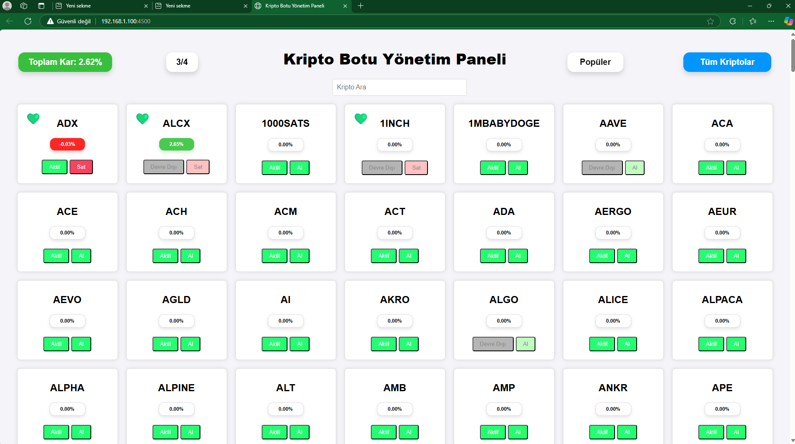
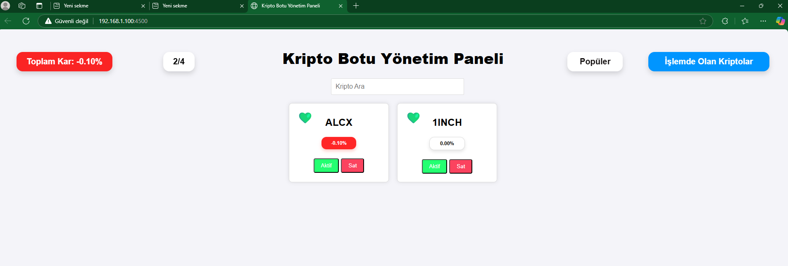
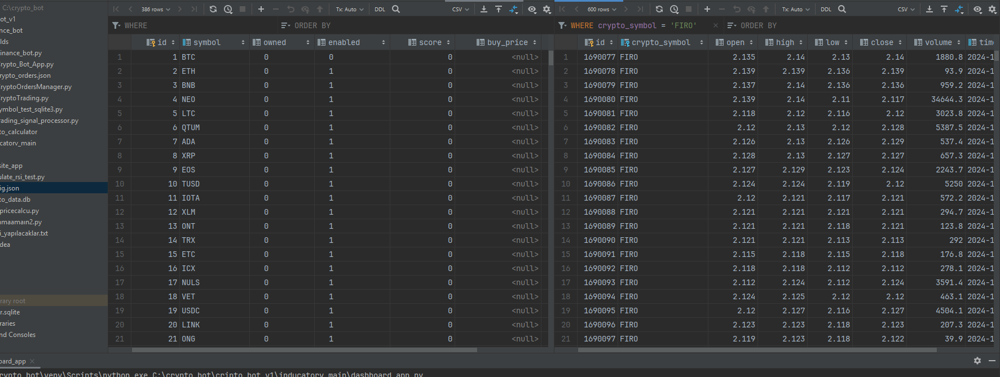
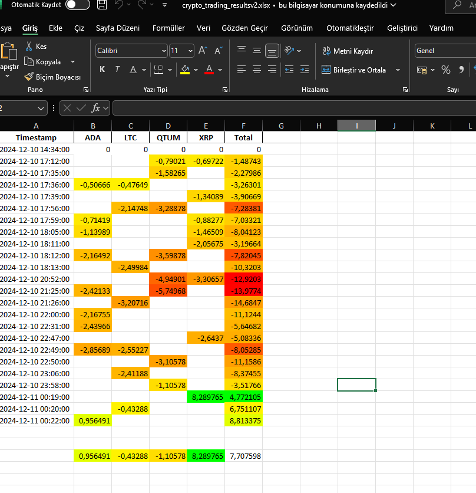
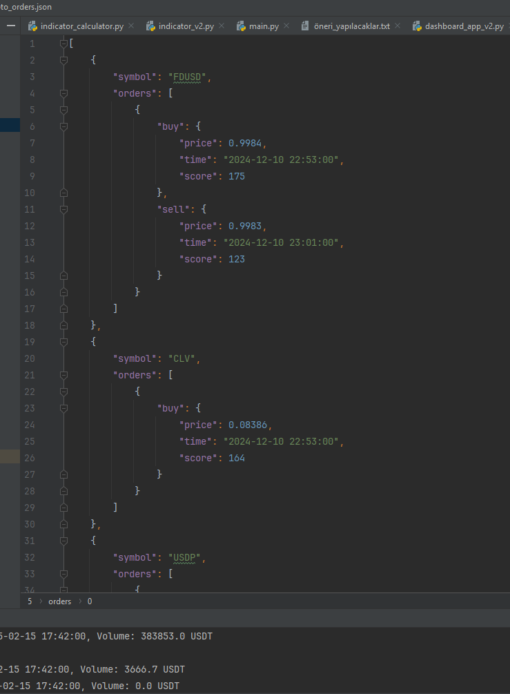

# 🚀 Kripto Para Ticaret Botu

  

Bu proje, **otomatik alım-satım** yapabilen, **teknik analiz** göstergeleri kullanan ve **web arayüzü** üzerinden kontrol edilebilen kapsamlı bir **kripto ticaret botudur**.

---

## 🔥 Başlangıç

Botu başlatmak için:
```
python -m cripto_bot_v1.binance_bot.Crypto_Bot_App
```
Bu komut, veri toplayıcıdan işlem yöneticisine kadar tüm bileşenleri başlatır.

Eğer **Python komutunu** doğrudan kullanamıyorsanız ve PATH ile ilgili bir sorun varsa, şu komutu da alternatif olarak kullanabilirsiniz:
```
cd C:\crypto_bot
C:\crypto_bot\venv\Scripts\python.exe -m cripto_bot_v1.binance_bot.Crypto_Bot_App
```
Not: Eğer "cd C:\crypto_bot" komutunu kullanacaksanız, dosyaların C:\crypto_bot klasörüne kurulduğundan emin olun veya dosyaların olduğu dizini girerek devam edin.

---

## 🌟 Temel Özellikler

✅ **Binance Borsası** tam entegrasyon  
✅ **Gerçek zamanlı fiyat takibi** (60 saniyelik veya özelleştirilebilir aralıklarla)  
✅ **Teknik analiz göstergeleri** ile alım-satım sinyalleri  
✅ **Web tabanlı kontrol paneli** (FastAPI + WebSocket)  
✅ **Çoklu kripto para desteği**  
✅ **SQLite veritabanı** ile işlem geçmişi kaydı  
✅ **Test modu (Paper Trading)** desteği  
✅ **Manuel ve otomatik işlem seçenekleri**  
✅ **Performans grafikleri ve analiz araçları**

---

## ⚙️ Sistem Mimarisi

### **1️⃣ Veri Toplayıcı** 📊  
- Binance API'den fiyat verisi çeker  
- Çoklu thread yapısı ile yüksek hız  
- Verileri SQLite'e kaydeder  
- Otomatik hata yönetimi

### **2️⃣ Sinyal İşleyici** 📈  
- Teknik analiz göstergeleri hesaplar  
- **Bollinger Bantları, RSI ve özel göstergeler** kullanır  
- Skor bazlı değerlendirme (1-10 arası)  
- Çoklu gösterge kombinasyonu ile karar mekanizması

### **3️⃣ İşlem Yöneticisi** 💰  
- Alım-satım emirlerini yönetir  
- **Binance API ile güvenli emir gönderimi**  
- Risk yönetimi ve kar/zarar takibi  
- İşlem geçmişi kaydı

### **4️⃣ Web Arayüzü** 🌍  
- **Gerçek zamanlı fiyat takibi ve emir yönetimi**  
- Kullanıcı dostu panel (FastAPI + WebSocket)  
- **İşlem geçmişi ve performans grafikleri**

  
  

---

## 🔧 Konfigürasyon

Binance API ayarları şu dosyada yapılandırılabilir:
```
crypto_bot/cripto_bot_v1/config.json
```
📌 **Önemli:** API anahtarlarınızı güvenli tutun!

---

## 🎛 Kullanım Kılavuzu

### 🖥 Komut Satırı Komutları
```
saç     # Al/sat sinyallerini erkenden hesaplamaya başlar (isteğe bağlı)
aç      # Otomatik alım-satımı aktifleştirir
kapat   # Otomatik alım-satımı kapatır
```

### 🌐 Web Arayüzü
Tüm işlemleri tarayıcınızdan yönetebilirsiniz! 🚀

---

## ⚠️ Önemli Notlar

🔸 Bot başlatıldığında **varsayılan olarak alım-satım devre dışıdır**  
🔸 Test modunda **gerçek işlem yapılmaz**  
🔸 **Bilgisayar saatinin senkronize olması önemlidir**  
🔸 **API anahtarlarını güvenli tutun** (Yanlış kullanım ciddi zararlara yol açabilir)  
🔸 **Risk yönetimi ayarlarını dikkatlice yapılandırın**

---

## 🛠 Hata Ayıklama

🔹 **Binance API Hataları:**  
- API anahtarlarını kontrol edin 🔑  
- Bilgisayar saatini doğrulayın 🕒  

🔹 **Web Arayüzü Çalışmıyor:**  
- Port çakışmalarını kontrol edin 🔍  
- WebSocket bağlantısını kontrol edin 🌐

---

## 📂 Dosya Yapısı

📌 **cripto_bot_v1/binance_bot/Crypto_Bot_App.py** → **Ana giriş noktası** 🚀  
📌 **cripto_bot_v1/binance_bot/binance_bot.py** → **Binance API bağlantısı** 🔗  
📌 **cripto_bot_v1/binance_bot/trading_signal_processor.py** → **Sinyal hesaplama** 📊  
📌 **cripto_bot_v1/sql/** → **SQLite veritabanı işlemleri** 🗄  
📌 **cripto_bot_v1/inducatorv_main/** → **Teknik analiz göstergeleri** 📈  
📌 **cripto_bot_v1/website_app/** → **Web arayüzü modülleri** 🌍

---

## 🔎 Nasıl Çalışır?

1️⃣ **Başlat:**  
   - `Crypto_Bot_App.py` çalıştırılır  
   - **Veri toplama, sinyal işleme, işlem yönetimi ve web arayüzü eş zamanlı başlar**  

2️⃣ **Veri Toplama:**  
   - Binance API'den veriler alınır  
   - **SQLite veritabanına kaydedilir**  

3️⃣ **Sinyal Üretimi:**  
   - **Teknik analiz hesaplanır**  
   - **Alım-satım sinyalleri üretilir** ve işlem yöneticisine gönderilir  

4️⃣ **İşlem Yönetimi:**  
   - **Kullanıcı komutlarına göre işlemler gerçekleştirilir**  
   - Binance API'ye güvenli emirler gönderilir  

5️⃣ **Web Arayüzü:**  
   - **Gerçek zamanlı güncellemeler WebSocket ile sağlanır**  
   - **Tüm işlemler tarayıcıdan yönetilebilir**

---

## 💡 Kendi İndikatörlerinizi Oluşturun

Bot, mevcut indikatörler ve teknik analiz araçlarıyla hazır bir şekilde gelir, ancak siz **kendi özel göstergelerinizi** oluşturabilir ve test edebilirsiniz! 💻📊

- **Yeni göstergeler eklemek için** `cripto_bot_v1/inducatorv_main/` klasöründe yeni dosyalar oluşturabilirsiniz.  
- İhtiyacınıza göre **göstergeleri özelleştirebilir** ve **performanslarını test edebilirsiniz**.

🚀 **Güvenli ve kârlı işlemler dileriz!** 📈💰

---

## 📸 Ek Görseller



  

  


